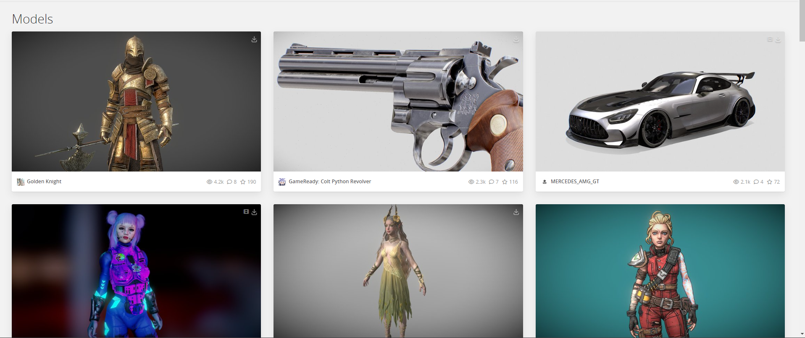
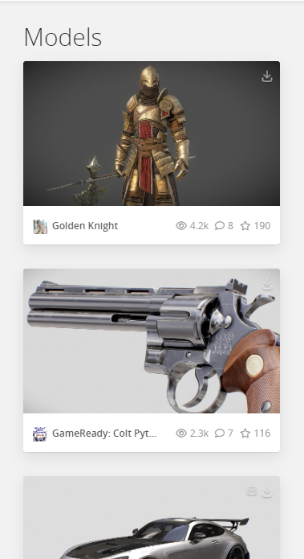

# Description

We need to design a product card that features a 3D object and provides an interactive experience for the user. The design should include a hover effect that causes the object to rotate, allowing the viewer to see it from multiple angles.

# General Requirements

- [Next.js w/ TypeScript](https://nextjs.org/docs/basic-features/typescript)
- [Tailwind CSS](https://tailwindcss.com/docs/guides/nextjs)
- [React Three Fiber](https://docs.pmnd.rs/react-three-fiber/getting-started/introduction)

# Example Images

## Desktop

## Mobile

